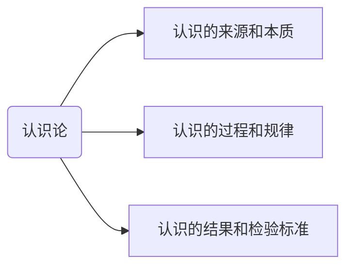
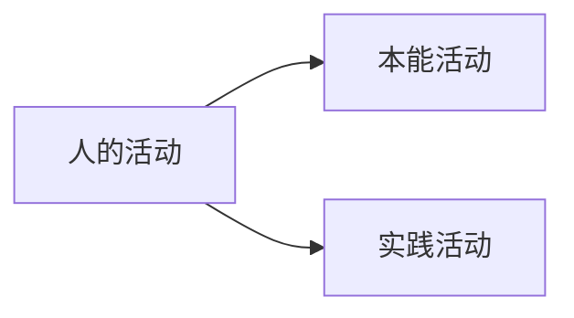
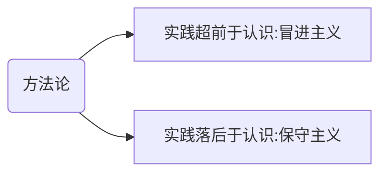
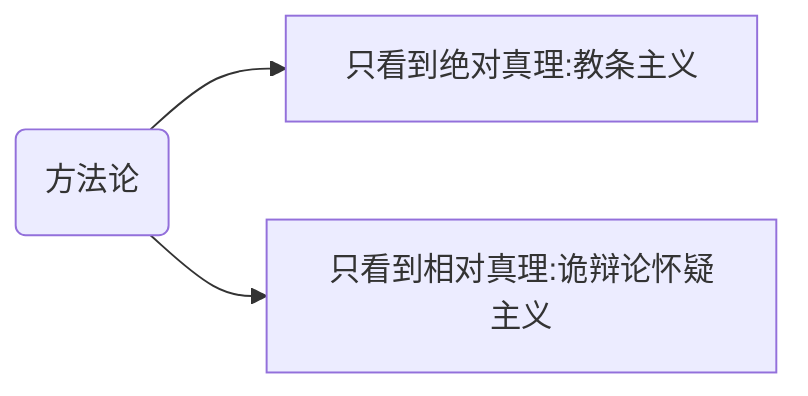

# 第一节 认识与实践

认识论讲的是主观世界的问题，头脑中的认知是怎么来的

## 考点26 实践的本质和特征

认识来源于实践，认识由实践派生出来的。
实践属于物质，认识属于意识

**以下观点全错**
- 中国古代：狭隘的将道德行为看作实践
- 康德：忽略了实践的客体，强调了实践的主体
    - 理性自主：强调了主体
- 黑格尔： 把实践当成了精神活动。
- 费尔巴哈：狭隘的把实践理解为生理行为。
---
**实践人独有的行为**

正确的实践观：
- 感性的：实践是要有意识来指导的，并且体现着主体的意愿和目的。
- 对象性：实践光有人不行，还必须有一个客体，必须有个对象
- 物质活动：具有客观性

---
实践的本质和特征：
（本质特性）**直接现实性**：实践具有将“脑中的”
自觉能动性：实践受意识的指导，体现主体的目的性
社会历史性：不同历史阶段实践内涵不同

## 考点27 实践的基本结构和形式
人拿着斧头劈树
人是主体，斧头是中介，树是客体

**客体是物，但不是所有的物都是客体**比如：还没有被人类观察到的星球。

本能活动：饿了要吃。

## 考点28 实践决定认识
- 第一：认识来源于实践但受天赋的影响，天赋仅仅有影响作用。（做同一件事收获不一样）；间接经验也是影响因素（通过别人的实践获取经验，听人讲）

## 考点29 认识的本质
- 唯心主义认识论————先验论
    - 从思想到物
- 唯物主义认识论————反映论
    - 从物到感觉思想
- 机械反应论
    - 看到什么就是什么。
- 能动反映论
    - 可以联想，比如看到一只鸡，想到了红烧鸡
    

## 考点30 认识过程的两次飞跃
- 感性认识
    - 对象：事物的现象，事物的外部联系，事物的各个方面
    - 形式：感觉，知觉，表象。
    - 特点： 直接性，**具体性**

- 理性认识：
    - 对象：事物的本质，全体，内部联系和事物自身规律
    - 形式： 概念，判断，推理。
    - 特点： 间接性和抽象性

以上内容包括区别。
   
**通俗解释**
感性认识：外部世界直接作用于感官。
理性认识：通过提炼抽象归纳出来的认识。
在现实中，两者永远结合在一切，瓜是红的，一个是因为光的反射，另一个就是人类对于红色的定义。

联系：
看书吧

选择题考法：
空口说都一样重要，但是如果通过了某个名言，则可以说某个重要。

## 考点31
1. 牛顿发现了万有引力，平时的日常思考这个是理性思考；突然苹果落地，突然顿悟，这个是感性因素，

感性认识和理性认识已经是个认识了，已经获得了。
感性因素和理性因素，他是在认识过程中起作用的两个因素。

## 考点32 认识的规律-反复性

## 考点 33
有多大的认知就做多大的实践，要相统一。

当实践超前认识，叫冒进。
认知水平高，实践不走，叫保守

# 真理与价值

## 考点34 真理及其特性
**真理一定是有用的**，这个说法正确

- 特点：
    - 客观性
        - 一元性
    - 绝对性
    - 相对性

- 真理具有客观性
    - 从内容看：外部的物质世界是客观的，真理是对外部的物质世界进行反映。
    - 从检验标准来看：实践，实践是一种客观的物质性活动。

***真理的形式是主观的***

***真理即有绝对性，又有相对性***
- 真理具有绝对性
    - 一。被称之为真理，则一定是对的。
    - 二。人类有能力**正确**认识外部世界，现在已经获取了真理，那么它绝对是对的
- 真理具有相对性
    - 未来有可能会被推翻。
    - 自己的认识水平也可能提高

相互依存：没有绝对性就没有相对性，没有相对性就没有绝对性。

绝对真理在概念上存在，但是实际中不存在，

- 至上性：人完全有能力认识这个外部世界 --> 所以我的认知具有绝对真理性
- 非至上性：目前人还没这个能力 --> 所以获得的真理具有相对性。

真理的相对性不等于谬误。

真理的相对性是未来有可能变错，而谬误现在就是错的

## 考点37 真理与价值的辩证统一
价值的特点
- 客观性：不以人的意志为转移
- 主体性：主体不同，价值不同，人不一样，价值不一样。
    - 比如一碗米，对于南北方人来说不一样
    - **主体性不等于主观性**，价值没有主观性
- 多维性：维度不同，价值不同。比如：个人维度，社会维度。比如考上研究生，对于个人的价值和对于学校来说，不一样。

- 历史时期不同，价值不同。比如：石油

关系：
人类的实践有两把尺子在衡量实践，即真理和实践，我们的实践既要符合真理，又要创造价值。
只尊重真理————即使能办到，也没有意义。
只尊重价值————办不到。
所以要即尊重真理，又尊重价值

***真理必然是有价值的***

## 考点39 自由和必然
自由：想怎样就怎么样。**体现人的能动性**
必然：我该怎么样。比如人必然会死。**体现客观规律**。

在人类起源的时候，必然更多，因为那时候很弱小，后来人类的发展，比如防洪的措施，人类获得了更多的自由；所以人类的发展过程就是由必然走向自由。
但是**自由并不意味着必然的消失**，只不过人类不断认知它，实现自己的自由。

自由是有条件的：
1. 是认识条件：认知越多，越自由
2. 是实践条件：
    1. 自由以必然为限度
    2. 自由以不牺牲别人的自由为限度的

