# 第一章
### 考点12
**考法：** 会把重要因素夸大为决定性因素，或者贬低为不重要因素

1. 语言是物质，但是语言的含义是意识
2. 意识的内容就是物质本身，是客观的；意识的形式是主观的

# 第二章

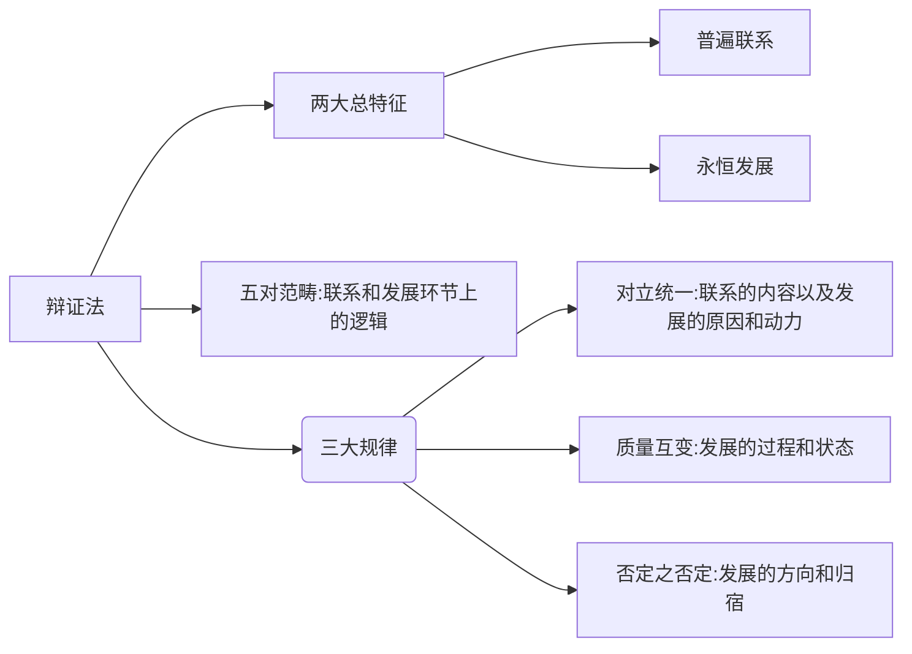

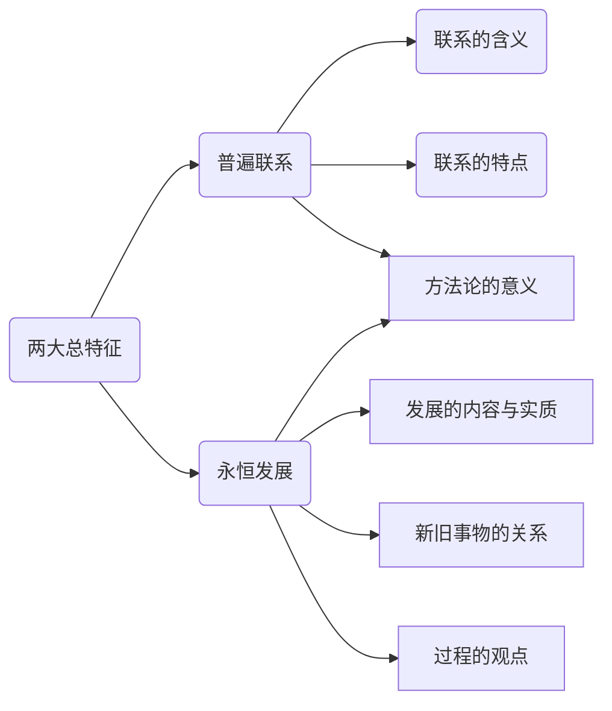

## 辩证法的两大总特征

### 考点15
*联系是以区别为前提的*

#####事物的永恒发展
1. 运动 == 变化
2. 运动(绝对的，无条件的) = 变化 > 发展
   1. 运动有向前运动和向后运动
   2. 变化有好的变化和坏的变化
   3. 而发展只是向前和好的
3. 发展不是无条件的和绝对的，但是是**永恒的** 。大趋势上，事物是发展的，偶尔有倒退
4. ~~新事物一定产生于旧事物之后~~，但如果是往往产生，那么是对的
   1. 新旧事物的区分不是按照时间
5. 过程的观点（世界是永恒发展的，所以现存事物不过是个过程）
   1. 世界不是即成事物的集合体，而是过程的集合体
   2. 一切在历史上产生的都要在历史上灭亡
   3. 任何事物都有它的过去，现在和将来
   4. 

## 辩证法五对范畴
五对范畴在两大总特征之上探讨联合发展环节上的逻辑，比如是什么联系：必然联系or偶然联系
这节课就是探讨具体有哪些不同的情形

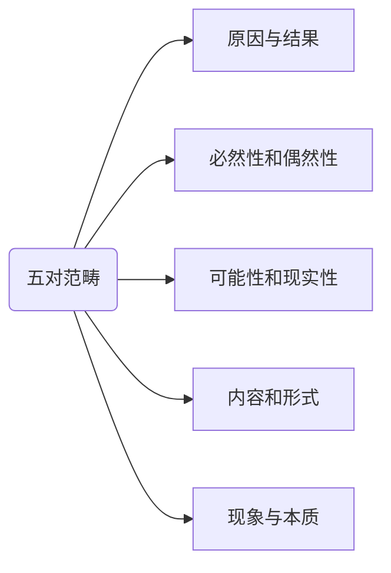

***
### 考点16
~~前后相继的关系即为因果~~
原因：发生在你之后未必是你导致的
- 在既定条件下，因果的区分是确定的。但若是忽略了条件说是确定的，那么就不对，因为一个人即可能是因，也可能是果
- ~~又其因必有其果~~，因为违背了复杂多样，“其”是错的
- 有因必有果，这个是对的

---

### 考点17
***世界上发生的所有事既是必然，也是偶然，是必然和偶然的辩证统一。***
>缘分，概括了必然和偶然

- 必然寓于偶然之中（通过大量的偶然表现出来）
  - 10岁吃芒果中毒（偶然），15岁吃芒果中毒（偶然），20岁吃芒果中毒（偶然）， 后来发现是芒果过敏（必然）
  - 又假设，自己本身对芒果过敏，但是自己从来没有吃过芒果，所以这个必然事件没有通过偶然事件表现出来，就没有被人感知。

---

### 考点18 可能和现实
- 区别：蕴含在概念中

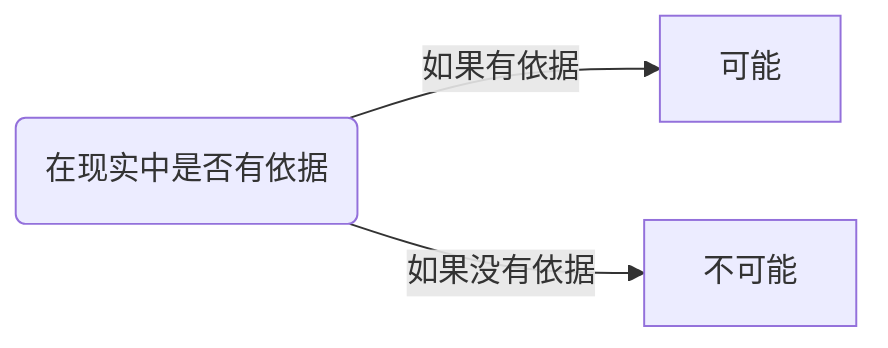
- 可能和不可能区分的根据：这件事情在现实中是否有依据。
  - 通过复习能不能考上研究生，（有依据）
  - 想再活500年，（没有依据）

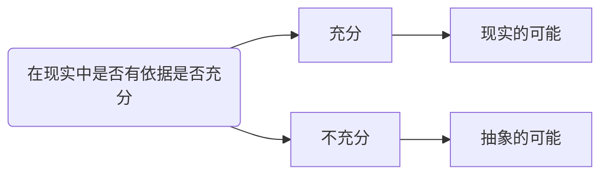
- 抽象的可能==潜在的可能
- 区分现实的可能和抽象的可能根据依据是否充分
  - 明年能考上研究生
  - 36岁在55岁当选国家军委主席（有可能），但是可能性太渺茫。

---

### 考点19 现象和本质(出题点多)
- 真像：从正面**直接**表达本质
- 假象：从侧面**歪曲**表达本质
>但真像和假象都是表达本质的

 

1. 相互区别
- 假象：客观存在的现象
  - 海市蜃楼，那座楼客观存在
  - 水里的筷子通过光的折射歪了
- 错觉：错误的感觉
  - 幻觉，自己瞎几把想
  - 放在桌子上的筷子变成了歪歪扭扭的筷子
  - ~~错觉一定是被假象迷糊导致~~。“有可能”被导致，但是不能是“一定”

2. 补充
- ~~真像是正确的现象~~，而错觉是错误的感觉.
  - 无论是真想还是假象，都是客观存在的，不能用正确和错误这两个词形容。比如长了个圆脸说人家说的对不对就是错误的。
  - 错觉是主观的感觉，有正确之分

- ~~真像往往隐藏在事物内部~~，而假象往往外露与事物外部
  - 无论是真像还是假象，都是现象，只要是现象都外露与事物外部，而只有本质才隐藏于事物内部
  - 区分**真相**==和==**真像**

---
### 考点20 内容和形式
马克思主义（内容）通过书本（形式）表现出来。
>生产力--内容
>生产关系--形式

---
## 辩证法三大规律

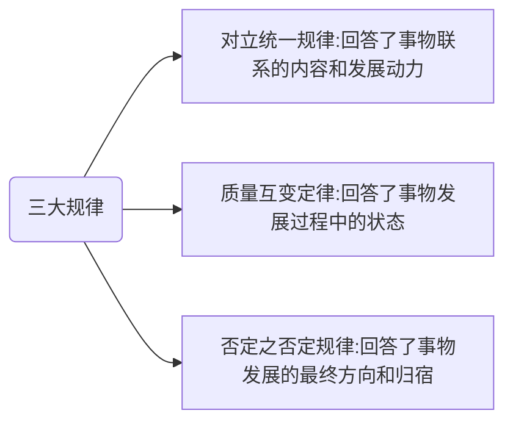
 
### 考点21 对立统一规律
***这节课最重要***

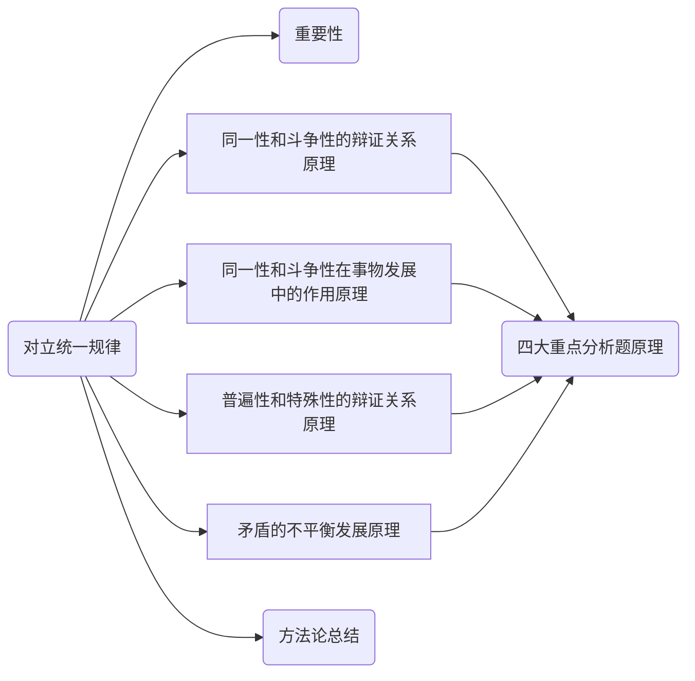
#### 1.同一性和斗争性的辩证关系原理
>矛盾：中性词，世间万物都以一对一对的形式存在，男人——女人。

**同一性**：
- 相互依存：没有上，也就没有下；没有强也就没有弱
- 相互贯通: 可以相互变通，上可以变成下，强可以变成弱

*只要是矛盾，就可以转，哪怕是男人和女人直接*

**斗争性**：
>**同一和斗争不是时而时而的关系，而是即，又得关系**

按照斗争得激烈程度，可以分为
- 对抗性
  矛盾双方斗得很激烈。（同时喜欢一个女得）
- 非对抗性
  斗得缓和，（一个人吃另一个人不喜欢得菜，可以让他滚一边吃）

>资本主义必将灭亡，原因为，资本主义存在诸多矛盾，这些矛盾将导致资本主义灭亡，这些矛盾是对抗性矛盾，所以必将灭亡。
而社会主义是人民内部矛盾，是非对抗性矛盾

**同一性和斗争性得关系**
>对立统一

- 相互联系：捡破烂的人不羡慕奔驰车羡慕另一个捡破烂的捡的多。
  - 因为他和奔驰车之间没有同一性，所以没有斗争性；而他和另一个捡破烂的同一性很强，所以具有斗争性
  - 马云赚了一个亿，舍友中彩票嫉妒，也是因为自己和舍友同一性强。

ps:消除斗争就要消除同一性。
同一越多，斗争越多。

2. **同一性和斗争性在事物发展中的作用原理**

- 第一：公司变好，自己工资高；自己变好，公司也会变好
- 第三：强和弱，开始的时候我强你弱，后来变成了你强我弱；但是你的强，比我开始的那个强更强

方法论：当同一性占据主要作用时则相辅相成，事物正向发展，当斗争性占据主要作用时则相反相成，事物逆向发展，而有时逆向发展也能做成一件事，所以逆向思维，从对立面把握统一。
和谐(对立统一，以分歧为前提而又没有闹奔溃)

3. **矛盾的普遍性和特殊性的辩证关系原理**

### 考点22 质量互变定律
- 质：认识质是认识和实践的起点和基础，只有认识质才能区别事物。
- 量
  - 认识事物的量是认识的深化和精确化
  - 只有正确了解事物的量，才能正确估计事物在实践中的地位和作用

>（第一）激变论：扩大了质变，否定了量变
> (第二)庸俗进化论：认为只有量变

方法论：
- 理论上的方法论：
  - 夸大质变导致：激变论
  - 夸大量变导致：庸俗进化论
- 实践中的方法论：
  - 适度原则（不要太多，也不要太少，凡事超过了火候就变了）
  - 对社会主义（质）初级阶段（量）的认识
  - 改革（力度，速度，要拿捏好火候，把握住质和量），发展和稳定

### 考点23 否定之否定规律

回答的是：事物发展的方向和归宿问题，世间的万事万物将往哪里去发展？

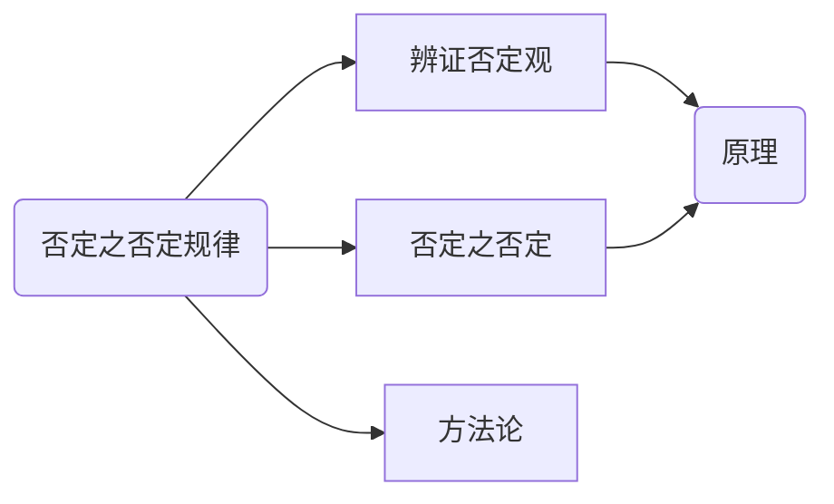

对于一个婴幼儿，其体内的肯定因素大于其否定因素，所以会成长，对于一个老子则反之。

- 自我否定：事物先天的基因决定了有一天会灭了自己
  - 有人认为否定是外在力量对事物进行消灭，这个是形而上。踩死一个猫猫虫，这个犯了把偶然当必然，辩证法讨论的时候所有的事物。踩死毛毛虫谈不上规律

- 扬弃。
  要么肯定一切，要么否定一切。这个是形而上的错误。

辩证否定观 | 形而上否定观
--|--
“自我否定” | “外在力量对事物进行否定和消灭”
“扬弃” | “要么肯定一切，要么否定一切”

---
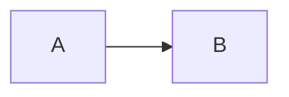
事物本身处于A状态，然后经过一个否定到了矛盾的对立面B状态

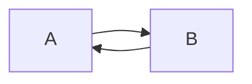
处于B状态的事物，再否定一次，返回A状态。

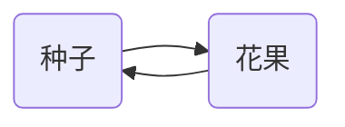
种子经过发展变为了花果，花果会枯萎腐烂，最后又剩下了种子。从自己，到不是自己，最后又发展成了自己。

但最后其实回来的那个A不是原来的A了，可能是A‘，比如最后可能得到一堆种子，而且是经过了自然界改良的种子。

---
**方法论：**

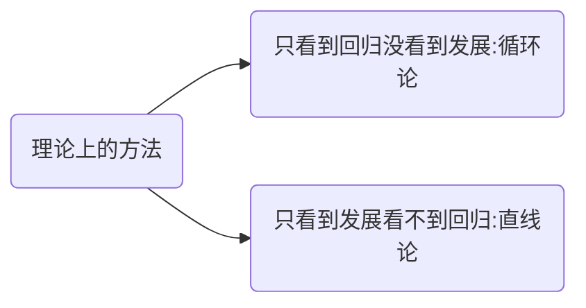

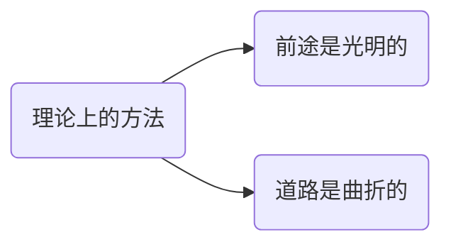

