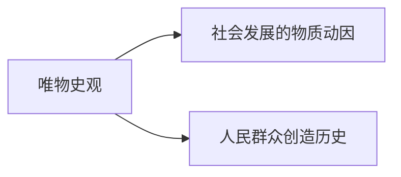

#第一节 社会基本矛盾及其运动规律
人类历史社会是个物质

## 考点40 唯物史观和唯心史观的对立

唯心史观缺陷1:只看看到了里斯发展背后的精神力量，而没有看到精神力量背后的物质动因|
-|-|
唯心史观缺陷2:只看到了历史发展中少数英雄人物的力量，而没有看到人民群众的作用|

缺陷1：男女平等，在古代因为体力，女人要依靠男人；但是在现代，随着生产力的发展，体力因素下降。

唯物史观

## 考点41 
社会存在：社会历史领域的物质,也就是物质在社会历史领域换了个名字
社会意识：社会历史领域的意识,也就是意识在社会历史领域换了个名字

生产方式= 生产力 + 生产关系

## 考点42 生产力和生产关系

生产力 = 劳动资料 + 劳动对象+劳动者
生产资料 = 劳动资料 + 劳动对象
所以生产力 = 生产资料 + 劳动者
 
>科学技术日益成为生产发展的**决定性**因素。
>科学技术是先进生产力的集中体现和主要标志。

1. ***但科技不是生产力中的独立要素***，科技可以渗透在三要素中，生产力包含了科技。
2. 若说科技在**生产劳动**中是对的。~~科技是社会历史中发挥决定性作用~~

注意区分：
1. 生产工具是区分社会经济时代的客观依据
2. 生产资料所有制是判定社会经济结构的客观依据
3. 生产力是人与自然的关系
4. 生产关系是人和人的关系

社会发展的第一规律：
**生产关系一定要适应生产力状况的规律**

## 考点43 
经济基础是(xxxadj)生产关系
生产关系**在级别上**等于经济基础。

生产力决定生产关系，而生产关系和经济基础在级别上相等，所以生产力能决定经济基础

**属于上层建筑的社会意识，就是社会意识形态**，前半句就在说意识形态，意识形态又属于社会意识，所以这句话正确。

>社会发展的第二规律:
>上层建筑一定要适应经济基础发展状况的规律

生产关系适应生产力的发展，则是先进的生产力，如果不是适应，则落后。
按照此逻辑:
上层建筑是否先进：~~上层建筑适应经济基础的发展，则先进，如果不适应，则落后~~**这种逻辑是错的**
正确的看法：
>**要看上层建筑 ***所服务*** 的经济基础能不能适应生产力，如果能，则说明经济基础先进，而上层建筑为经济基础服务，则是先进的上层建筑**

上层建筑反作用的性质，取决于它所服务的经济基础的性质，归根到底取决于它 ***是否有利于生产力的发展***

## 考点44 社会形态更替的一般规律及特殊形式

社会形态：经济基础与上层建筑的统一体

*注意区分社会意识形态*
**经济基础 + 上层建筑 = 社会形态。**

经济基础：经济形态。
上层建筑：政治形态，意识形态。

第三点
1. 特点一
    1. 更替：由奴隶——原始——封建——资本之间更替有什么特点。

    2. 统一性：所有社会都是一样的规律
    多样性：个别国家有不同

    3. 纵向看：从时间轴来看，所有的社会都要经历上述更替过程，但是不同的国家之间的过程有不同，比如中国，跳过了资本主义
    4. 横向看：中国的社会主义和朝鲜的社会主义有不同

2. 特点2：必然性和历史选择性
    1. 必然性：规律，社会从低级往高级发展是有规律的。
    2. 选择性：**能动**，人可以在历史发展过程中进行选择，比如中国结束了封建后选择了社会主义。
    3. 选择原因：看书上。
3. 特点3：前进性和曲折性
    1. 曲折性：迂回前进，螺旋上升，否定之否定

# 第二节 社会发展的动力

## 考点45

## 考点46

## 考点47
革命是实现社会形态更替的重要手段。

## 考点48
改革推动社会发展的又一重要动力

## 考点49
考法：夸大科技为根本动力或者贬低为没有动力
他是个重要动力

## 考点50 
看书上

## 考点51
现实的人：唯物史观必须研究到具体的人，也就是你我他，而不是研究抽象的人。
抽象的人：空泛的人，比如人是怎么样的，这种高度抽象的概念

社会关系的总和：我不是我的身体和血肉，而是谁的儿子，谁的朋友等诸多关系交织起来的一个点，人就是那个点，所以人和人的差别不是身体的差别，而是我的圈子和你的不一样。

人的本质不是人的自然属性，而是人的社会属性。

对于马克思哲学来说：被猴子抚养长大的人不算是人。

## 考点52
反动派：反历史潮流。
不是所有人都是人民群众，人民群众是个政治概念。一切逆历史潮流的都不是人民群众，比如：藏独，台独等。
你可能是老百姓，但可能不是人民群众，是不是人民群众取决于你当下在做什么。贪官污吏也是人民群众。

剥削阶级也可能是人民群众，在封建社会的时候，地主也是人民群众，它把人类从奴隶推向了封建。
所以是不是人民群众**取决于你是不是推动了历史发展**，而不是其他的什么。

## 考点53
历史人物也是人民群众，只不过厉害点，与人民群众一起创造历史

袁世凯复辟帝制算不算历史？
  这里的历史是两个概念，一个是政治上的历史，一个是历史课的历史，他指，时空中发生的所有事。
  但是在政治课上的历史，是指符合历史规律的事件。
  所以在政治课上，袁复辟不算历史